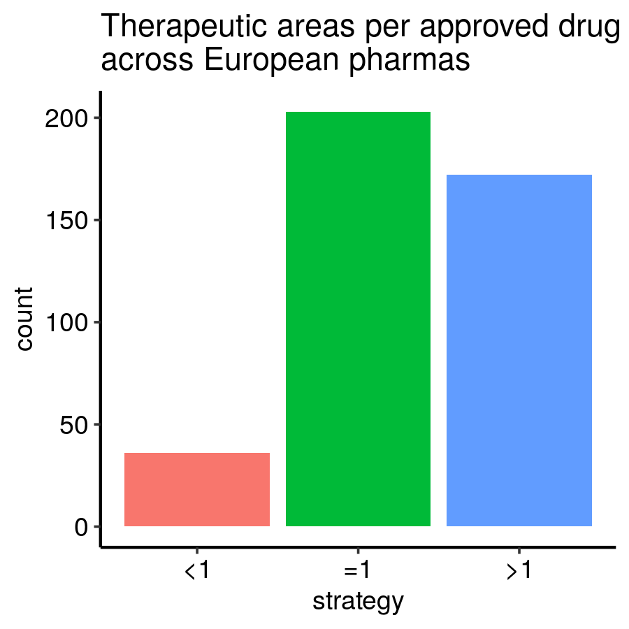

*An exploration of data scraped from the European Medicines Agency (EMA)*

---


Since the discovery of antibiotics, the availability of new drugs has substantially improved our lives. Drug development requires high investments that come with high uncertainty because we need to logically prove the safety and efficacy of new drug candidates before being freely administered in humans. Thus, pharmaceutical companies need to find a way through society’s health needs, international legal frameworks, and business motivations to succeed.

The European Medicines Agency (EMA) is the official regulator that directs drug development and decides whether to authorize marketing a new drug in Europe or not. In their webpage, they store information on every approved medicine and its corresponding marketing authorization holder (MAH) company.
To better understand the strategies implemented by successful European biotech companies and the EMA to keep developing new useful pharmaceuticals, I performed an exploratory analysis using information that I had previously scraped from EMA’s webpage on their 1222 drugs.


EMA’s effective advocacy of orphan drug development
---------------------------------------------------


According to the EMA, a drug acquires the “orphan designation” status when it is “intended for use against a rare condition”. Unfortunately, due to the small number of people that suffer from these diseases, they are likely to be disregarded as they represent a small market. In 2000, the EMA established a series of incentives (see regulations) for those companies who endeavour to develop orphan drugs giving an economic interest to those therapeutic areas with a high risk of being neglected. Basically, they offer a special treatment that speeds up the bureaucratic part of the process and cuts down its overall cost. Indeed, we immediately see the effectiveness of this policy as the number of approved orphan drugs has steadily increased since then. Obviously, we cannot see how many equivalent-to-orphan drugs had been approved before their definition but the trend seems clear.


Complex and prevalent diseases retain pharma’s interest
-------------------------------------------------------
From the 414 different therapeutic areas for which the EMA has granted marketing authorizations, almost 20% of the approved drugs try to tackle only the 9 diseases listed in the figure below.


What do all these diseases have in common? Their biological complexity; they are caused by multiple factors that can be very diverse across the population. Thus, the lack of a complete understanding of how they work makes it extremely hard to discover and develop drugs that fit for many patients. On the other hand, do pharmaceutical companies chose which disease to tackle only by their complexity? Probably, as mentioned above, they also take into account the number of people suffering from these conditions, which represents both the social impact of the disease itself and the market size for the drug. For example, the fact that, in 2018, 34.2 million US-citizens had diabetes, from which at least 90% of the cases correspond to type 2 diabetes may explain why most approved drugs are indicated for treating it. Especially for complex diseases, we expect to see these constant attempts to develop new and better drugs to enter a large market and be able to increase market share. It seems to be a win-win situation.


Out of curiosity, I further investigated what caused the peak in myocardial infarction drugs between 2005 and 2010. It was caused by the approval of 28 different generic drugs based on *clopidogrel*.


Drug development strategies of successful companies
---------------------------------------------------

The number of approved marketing authorizations held by a pharmaceutical company can be considered as a measure of success since it indicates how well each company could navigate through the drug development process.


The well-known Novartis approved 59 drugs with a rate of almost 3 drugs per year, from which none of them were generic. Conversely, Accord, the second pharma with the highest approval rate, approved 16 drugs in only 7 years. But, most of them (15 out of 16) were generic, which implies fewer studies and requirements than developing a completely new medicine. These were two examples of two very different strategies: Novartis has fully opted for innovation while Accord has opted for manufacturing many generics while developing fewer new drugs.


Diversify or die, really?
-------------------------
One common practice of venture capitalists is to diversify investments in order to spread the risk. Similarly, pharmaceutical companies have to choose which diseases they want to tackle.


Developing drugs for different therapeutic areas ensures taking shares in many markets. We see how companies with a high approval rate and a high number of total approved drugs also own drugs involved in many therapeutic areas, which may be mostly related to the business side of drug development.



In fact, most pharmaceutical companies choose to develop the same proportion of drugs than therapeutic areas or choose drug candidates with multiple indications. Then, after the approval of the medicine for the first indication, they do not need to go through the whole process again necessarily and increase the profits.


Not surprisingly, few companies have specialized in developing drugs for the same indications since it is a risky “business choice” that relies on the number and quality of competitors.


However, diversification of the therapeutic areas may become a double-edged sword. On the one side, finding new indications for approved drugs -also known as “drug repurposing”- maximizes and recycles the resources spent to go from bench to bedside and allows to increase the pool of available treatments for many diseases, which can help to cope with disease co-morbidities and secondary effects. On the other side, in the case that a drug cannot be repurposed, most biotech companies may have to start over developing new drugs that tackle different diseases in order to stay in business. Consequently, instead of leveraging their expertise, they may “repurpose” their trained teams to focus on a new, different aim and lose part of the experience acquired in the previous therapeutic area.


Diversification might slow down the overall advances in drug development to fulfill the business requirements. Nevertheless, what are the alternatives to the current model? Can we change it?


Exploratory Data Analysis with R
--------------------------------

For those who may wish to reproduce or further analyze these data.

0. **Load required libraries:**
```r
require(tibble)
require(readr)
require(stringr)
require(ggpubr)
```
1. **Prepare and wrangle data:**
```r
# download data
urlEMA = 'https://raw.githubusercontent.com/MiqG/EMA-Data-Scratching-with-RSelenium/master/drug_df_EMA.csv'
ema = read_csv(urlEMA)
# subset features of interest and change their names
featuresOI = c('Name',
               'Active substance',
               'International non-proprietary name (INN) or common name',
               'Generic',
               'Orphan',
               'Exceptional circumstances',
               'Countries',
               'Marketing-authorisation holder',
               'Therapeutic area (MeSH)',
               'Date of issue of marketing authorisation valid throughout the European Union')
newColNames = c('name',
                'substance_act',
                'substance_inn',
                'generic',
                'orphan',
                'exceptional_circ',
                'country',
                'mah',
                'mesh',
                'date')
ema = ema[featuresOI]
colnames(ema) = newColNames
ema$date = strptime(ema$date, '%d/%m/%Y')
ema$year = as.numeric(format(ema$date, '%Y'))
ema$generic = !is.na(ema$generic)
ema$orphan = !is.na(ema$orphan)
ema = ema[!is.na(ema$country),] # unsuccessful applications will have an empty Country
```


2. **Summarize data:**
```r
# study therapeutic areas
## list drugs and their therapeutic area (MeSH)
mesh = lapply(ema$mesh, function(meshTerms) unlist(strsplit(meshTerms, split = '\n')) )
names(mesh) = ema$name
## get their frequency percentages
mesh = table(unlist(mesh))
mesh = mesh / sum(mesh) * 100
mesh = sort(mesh, decreasing = TRUE)
mesh = tibble(therArea = names(mesh),
              perc = mesh)
# study approved drugs per therapeutic area per year
years = min(ema$year, na.rm = TRUE):max(ema$year, na.rm = TRUE)
therArea_perc = paste0(mesh$therArea,' (',round(mesh$perc,2),'%)')
meshApproved = expand.grid(therArea_perc = factor(therArea_perc, levels = therArea_perc), 
                           year = years)
meshApproved$therArea = gsub(' \\(.*','',as.character(meshApproved$therArea_perc))
meshApproved$nApprovedDrugs = sapply(1:nrow(meshApproved), function(idxRow){ 
    sum( str_count(ema$mesh[ema$year == meshApproved$year[idxRow]], pattern = as.character(meshApproved$therArea[idxRow])), na.rm = TRUE) 
    })
# study pharmaceutical companies
mahCount = sort(table(ema$mah), decreasing = TRUE)
mahCount = tibble(nApprovedDrugs = as.numeric(mahCount), mah = factor(names(mahCount), levels = names(mahCount)))
mahCount$deltaTime = sapply(mahCount$mah, function(mah) max(ema$year) - min(ema$year[ema$mah == mah]) )
mahCount$approvalRate = (mahCount$nApprovedDrugs) / (mahCount$deltaTime)
mahCount$approvalRate[mahCount$deltaTime <= 5] = 0
mahCount$weightedApprovalRate = mahCount$approvalRate * mahCount$nApprovedDrugs
mahCount$nTherAreas = sapply(mahCount$mah, function(mah) length(unique(unlist(strsplit(ema$mesh[ema$mah == mah], split = '\n')))) )
mahCount$module = sqrt((mahCount$approvalRate/sum(mahCount$approvalRate))^2 + (mahCount$nTherAreas/sum(mahCount$nTherAreas))^2)
mahCount$nTherAreaPerDrug = mahCount$nTherAreas / mahCount$nApprovedDrugs
mahCount$strategy = NA
mahCount$strategy[mahCount$nTherAreaPerDrug > 1] = '>1'
mahCount$strategy[mahCount$nTherAreaPerDrug == 1] = '=1'
mahCount$strategy[mahCount$nTherAreaPerDrug < 1] = '<1'
```

3. **Make figures**
```r
# variables
baseSize = 9
# orphan drugs
perc = round(sum(ema$orphan)/nrow(ema) * 100,2)
figTitle = paste0('Approved orphan drugs (',perc,'%)')
plt1 = ggplot(ema, aes(x = orphan, fill = orphan)) + 
       geom_bar() +
       scale_fill_viridis_d() +
       ggtitle(figTitle) +
       theme_pubr(legend = 'none', base_size = baseSize)
figTitle = 'Evolution of orphan drugs'
plt2 = ggplot(ema, aes(x = year, fill = orphan)) + 
       geom_bar() +
       scale_fill_viridis_d() +
       ggtitle(figTitle) +
       theme_pubr(legend = 'bottom', base_size = baseSize)
ggarrange(plt1, plt2, common.legend = TRUE)
# therapeutic areas
n = 9
figTitle = paste0('Evolution of drug approvals in top ',n,' therapeutic areas')
idxTherAreas = meshApproved$therArea %in%  mesh$therArea[1:n]
ggline(meshApproved[idxTherAreas,], x = 'year', y = 'nApprovedDrugs', color = 'therArea', 
       facet.by = 'therArea_perc', point.size = 0.1,
       title = figTitle, linetype = 'dashed', palette = 'jco') +
       theme_pubr(base_size = baseSize, x.text.angle = 45, legend = 'none')
# pharmas
## n mahs and approval rates
n = 10
mahCount = mahCount[order(mahCount$nApprovedDrugs, decreasing = TRUE),]
levels(mahCount$mah) = mahCount$mah
figTitle = paste('Top 10 Marketing Authorization Holders')
plt1 = ggplot(mahCount[1:n,], aes(x = mah, y = nApprovedDrugs)) + 
       geom_bar(stat = 'identity',fill='orange') +
       ggtitle(figTitle) +
       theme_pubr(legend = 'bottom', x.text.angle = 67, base_size = baseSize)
dat = mahCount[!is.infinite(mahCount$approvalRate),]
dat = dat[order(dat$approvalRate, decreasing = TRUE),]
dat$mah = factor(dat$mah, levels = dat$mah) 
figTitle = paste('Top 10 Approval Rate')
plt2 = ggplot(dat[1:n,], aes(x = mah, y = approvalRate)) + 
       geom_bar(stat = 'identity',fill='orange') +
       ggtitle(figTitle) +
       theme_pubr(legend = 'bottom', x.text.angle = 67, base_size = baseSize)
figTitle = paste('Marketing Authorization Holders out of', nrow(mahCount), 'companies')
annotate_figure(ggarrange(plt1, plt2), top = figTitle)
## diversification
### scatter
topNmah = mahCount$mah[order(mahCount$module, decreasing = TRUE)][1:4]
plt1 = ggscatter(mahCount, x = 'approvalRate', y = 'nApprovedDrugs',
          add = 'reg.line', conf.int = TRUE, add.params = list(linetype = 'dashed', fill = 'lightgray'),
          label = 'mah', label.select = topNmah, font.label = c(8, 'darkorange'), 
          repel = TRUE, label.rectangle = FALSE, size = 0.5, alpha = 0.75,
          theme = theme_pubr(base_size = baseSize)) +
          stat_regline_equation(label.x = 2, label.y = 5, size = 3)
plt2 = ggscatter(mahCount, x = 'approvalRate', y = 'nTherAreas',
          add = 'reg.line', conf.int = TRUE, add.params = list(linetype = 'dashed', fill = 'lightgray'),
          label = 'mah', label.select = topNmah, font.label = c(8, 'darkorange'), 
          repel = TRUE, label.rectangle = FALSE, size = 0.5, alpha = 0.75,
          theme = theme_pubr(base_size = baseSize)) +
          stat_regline_equation(label.x = 2, label.y = 5, size = 3) 
figTitle = paste('Diversification in therapeutic areas of\nsuccessful pharmaceutical companies')
annotate_figure(ggarrange(plt1, plt2), top = figTitle)
### bar plot
figTitle = 'Therapeutic areas per approved drug\nacross European pharmas'
ggplot(mahCount, aes(strategy, fill = strategy)) +
  geom_bar() +
  ggtitle(figTitle) +
  theme_pubr(x.text.angle = 0, legend = 'none', base_size = baseSize)
```
